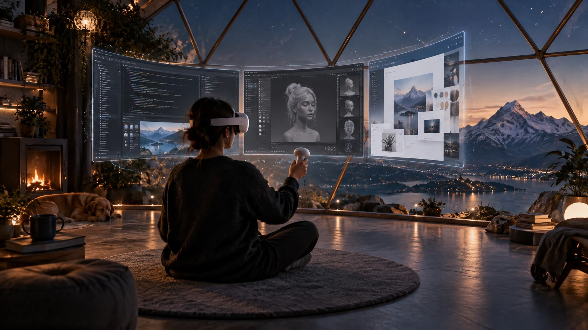

<p align="center">
  
</p>

<h1 align="center">ArX VR</h1>

<p align="center"><b>Your Mac, around you.</b><br>
A free, open source bridge that puts your Mac's desktops inside a Meta Quest headset, 1:1, with your hands, your voice and a world of your choosing.</p>

<p align="center">
  
  
  
</p>

> The images here are generated placeholders. Real captures and a video walkthrough are coming.

---

## What it does

- **Your real Mac screen, curved around you.** Not a copy of an app: the actual display, hardware encoded on the Mac and decoded on the headset.
- **Extra real desktops.** *Add desktop* plugs another display into your Mac while you wear the headset. Take the headset off and they unplug, their windows moving back to the laptop screen. Put it on and they return.
- **Every desktop behaves the same.** Grab anywhere to move it, push or pull it, change its curve, resize from a corner, send a window to another desktop by pointing at it.
- **Controllers or hands.** Both have the full vocabulary: click, right click, scroll, drag, move, dictate.
- **Local dictation.** Hold a button and speak. whisper.cpp transcribes on your Mac and types where your cursor is. Nothing goes to the cloud.
- **Worlds.** Work in passthrough, in a calm procedural space, or inside a Gaussian splat world you generate yourself, with its own ambient music.
- **A mirror on the Mac.** *Show what the headset sees* opens the headset's view in a window, ready to record.
- **Nothing hidden.** One bridge app on the Mac. Close its window and everything stops: capture, the server, the extra displays.

## Requirements

| | |
|---|---|
| **Mac** | Apple Silicon, macOS 14 Sonoma or newer. Intel Macs and Windows are not supported yet. |
| **Headset** | Meta Quest 2 (tested). Quest 3, 3S and Pro should work but are untested. |
| **Cable** | A USB-C **data** cable, for the first connection and for installs. After that the video runs over Wi-Fi, with the cable as fallback. |
| **Developer Mode** | On the headset, switched on from the Meta Horizon phone app (Devices, your headset, Headset settings, Developer Mode). |
| **Xcode Command Line Tools** | `xcode-select --install`. Provides `clang`, `codesign` and Python 3. |
| **Disk** | About 5 GB for the Android build toolchain, installed once into `~/.arxvr_toolchain`. |
| Optional: dictation | [Homebrew](https://brew.sh). The first run sets up the rest, see [Dictation](#dictation). |
| Optional: worlds | A [World Labs](https://www.worldlabs.ai) API key, and `pip install numpy pillow requests`. |

## Quick start

1. **Clone** this repository.
2. **Plug the Quest into the Mac**, put it on, and accept *Allow USB debugging* (tick *Always allow from this computer*).
3. **Double-click `Start ArX VR.command`.**

The first time, it lists what it still has to build on your Mac and asks before doing anything:

- the Android toolchain (it asks again before accepting Google's SDK licences),
- the Quest app,
- the Mac bridge, installed to `~/Applications/ArX VR Bridge.app`.

Then it opens the bridge, waits for the headset, installs the app if the headset has an older one, and launches it. Put the headset on.

> Downloaded the ZIP instead of cloning? macOS may refuse to open the file. Right-click it and choose **Open** once.

### Mac permissions

The bridge window shows two lights. Grant both the first time, then close the bridge and double-click again.

- **Screen Recording**, so it can capture your displays.
- **Accessibility**, so the headset can move your mouse and type.

Both are in System Settings, Privacy & Security. If you have an Apple Development certificate the bridge is signed with it, and the grants survive rebuilds. Without one it signs ad-hoc, and macOS asks again after every rebuild.

### Every time after

Double-click `Start ArX VR.command`, put the headset on. Close the bridge window to stop everything.

`python3 quest_app/arxvr.py` opens the full control panel: start or stop a session, status, rebuild, install, a screenshot of the headset view, and the world tools.

## Controls

Both controllers work the same, and every desktop works the same.

| Action | Controller | Hands |
|---|---|---|
| Click, hold to drag | Trigger | Pinch index finger |
| Right click | B or Y | Pinch middle finger |
| Dictate | Tap A or X, or hold to talk | Dictate in the pie menu |
| Scroll | Thumbstick, any direction | Pinch little finger, move hand |
| Move a desktop | Grip anywhere on it, swing | Make a fist on it, swing |
| Distance and curve | Grip, then the thumbstick | Reach out or draw back |
| Resize | Grip a corner | Fist on a corner |
| Window to another desktop | Hold trigger, point across | Hold the pinch, point across |
| Pie menu | Click a thumbstick, tilt, let go | Pinch in empty air |
| Keyboard, Overview, new desktop | In the pie menu | In the pie menu |
| Desktops in front of you | Menu button | Palm up, hold the pinch |

The same card is inside the app: *Guide*, in the dock.

## Dictation

Dictation runs [whisper.cpp](https://github.com/ggml-org/whisper.cpp) on the Mac, with the `small.en` model. The first run offers to set it up (Homebrew installs whisper.cpp, and a 490 MB model goes to `~/Library/Application Support/ArX VR Bridge/models`). Skipped it? Run `python3 quest_app/arxvr.py` and choose **Set up local dictation**.

Without it the bridge still works, and the headset tells you dictation is off. If you already use OpenWispr, the bridge reads its model, language and prompt from `~/.config/open-wispr`, so there is nothing to set up.

## Worlds

Open the pie menu and choose **World**.

- **Passthrough**: your own room.
- **Calm**: a quiet procedural space.
- **Your worlds**: Gaussian splat worlds you generate, each with optional ambient music. Pick the same world again to switch between the full 3D splats and a lighter flat 360 picture of it.

No worlds ship with this repository. You make them from the control panel:

```bash
python3 quest_app/arxvr.py
```

1. **Make a splat world with Marble**: from one picture or a sentence, through the [World Labs](https://www.worldlabs.ai) World API. Put your key in `WORLD_LABS_API_KEY` (environment, or a `.env` at the repo root). It shows the credit cost and asks first.
2. **Turn a splat file into a headset world**: for `.ply`, `.spz` or `.splat` files you already have. It levels the floor, sets real scale and puts the seat under you.
3. **Merge a splat world**: fewer splats, the same picture from your seat. Worth it on a Quest 2.
4. **Check a splat world on the Mac**: renders it with the headset's own shaders beside a reference renderer.
5. **Put a world on the headset**.

Built worlds live in `~/arxVR_worlds/<name>/`: `world.splat`, its picker tile `texture.jpg`, and the flat 360 `panorama.jpg` when Marble made one. For music, drop any looping `ambient.ogg` into the folder. `~/arxVR_worlds/layout.txt` sets their order in the picker, one folder name per line. More in [docs/SPLAT_WORLDS.md](docs/SPLAT_WORLDS.md).

Splat worlds are heavy for a Quest 2. The renderer draws a sharp view where you look and a softer surround behind it, joined by a brush-stroke edge you only catch on fast turns.

## How it works

```
Mac: ArX VR Bridge.app                                  Quest: ArX VR (OpenXR, GLES 3.2)
  ScreenCaptureKit -> VideoToolbox H.264  -- Wi-Fi -->    MediaCodec -> curved desktop layers
  virtual displays for extra desktops     (USB fallback)  pie menu, keyboard, hands, worlds
  mouse and keyboard from the headset     <-- input ---   native splat renderer
  whisper.cpp dictation
```

Over USB, once, the headset receives the bridge's address and a secret token. Every request after that, video included, must carry the token. There is no pairing code.

## Repository layout

```
Start ArX VR.command     double-click entry point
quest_app/
  arxvr.py               control panel: session, build, install, worlds
  streaming/             the Quest app; native OpenXR renderer in src/main/jni/xr-renderer
  host_tools/            the Mac bridge: arxvr_voice_bridge.py, build_arxvr_mac.py, macos/*.m
  host_tools/worlds/     world tools: Marble client, splat converter and merger, Mac harness
  tests/                 toolchain setup, builds, APK verification, unit tests
  THIRD_PARTY.md         provenance and licences of adopted code
docs/                    SPLAT_WORLDS.md, images
```

## Status

A working personal tool, released as is, used daily on a Quest 2 with an Apple Silicon Mac.

- **Mac only for now.** A Windows bridge is being considered.
- The bridge is a developer build, not notarized. You build it on your own Mac.
- Splat worlds still stutter on Quest 2 during fast head turns.

Issues and pull requests are welcome.

## Licence

[GPL-3.0](LICENSE). The Quest app is derived from [Moonlight XR](https://github.com/Gilleece/moonlight-android-xr), itself GPL-3.0, and bundles OpenXR, Opus, OpenSSL, ENet and other components under their own licences. All are listed in [quest_app/THIRD_PARTY.md](quest_app/THIRD_PARTY.md), and the licence texts ship inside the app.

## Credits

Built by [Alin Bolcas](https://arvolve.ai) at Arvolve. Thanks to the Moonlight and Moonlight XR projects, whisper.cpp, and World Labs for Marble.
